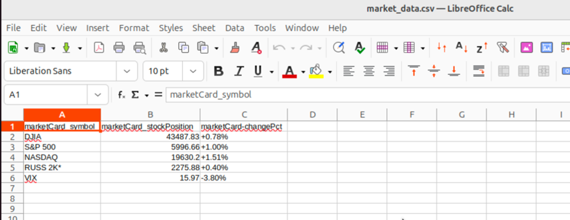

# Lab Assignment 1 - DSCI 560 #
## Overview ##
This repository contains all components for Lab Assignment 1 of the DSCI 560 course. It focuses on setting up a Linux-based development environment, writing Python scripts, performing web scraping, and filtering data into structured formats.

## Repository Structure ## 
```
prathamsolanki_3242692358/
├── data/
│   ├── raw_data/         # Contains raw dataset
│   ├── processed_data/   # Contains processed datasets (market_data.csv, news_data.csv)
├── scripts/              # Python scripts for performing various tasks
│   ├── task1.py          # Basic script to greet a user
│   ├── web_scraper.py    # Web scraping script using BeautifulSoup
│   ├── data_filter.py    # Script to filter and process data
├── Lab1_pratham_solanki.pdf       # Detailed report of the lab tasks and outputs
├── Lab1-s25.pdf          # Lab manual
```

## Features ## 
Environment Setup: Installation and configuration of Ubuntu VM, Python, and pip.
Basic Python Script: A simple Python script to greet users with a personalized message.
Web Scraping:
Scraped market banner and latest news from CNBC.
Saved raw HTML data to raw_data/web_data.html.
Data Filtering:
Extracted specific fields from web data.
Generated structured CSV files (market_data.csv and news_data.csv) in processed_data.

## Setup Instructions ##
1. Clone the repository
```
git clone https://github.com/prathamsolanki-USC/Lab1_DSCI-560.git
cd prathamsolanki_3242692358
```

2. Ensure Python and pip are installed
```
sudo apt update
sudo apt install python3 python3-pip
```  

3. Run Python scripts as needed
```
python3 scripts/task1.py
python3 scripts/web_scraper.py
python3 scripts/data_filter.py
```

## Documentation ## 
Lab Manual: Lab1-s25.pdf includes assignment instructions.  
Lab Report: Lab1_pratham_solanki.pdf documents setup steps, outputs, and results with screenshots.

## Python Scripts ##
task1.py  
Path: scripts/task1.py  
Description: A basic script that prompts the user for their name and greets them with "Hello, [name]!".

web_scraper.py  
Path: scripts/web_scraper.py  
Description: A web scraping script that collects data from the CNBC World page using Requests,BeautifulSoup and Selenium. The raw HTML data is saved in the data/raw_data/web_data.html.

data_filter.py  
Path: scripts/data_filter.py  
Description: A script to filter specific data from the raw HTML (web_data.html) and generate CSV files (market_data.csv and news_data.csv) in the data/processed_data/.

## Outputs ## 
Raw Data:   
HTML content saved in data/raw_data/web_data.html.  

Processed Data:   
Market data in data/processed_data/market_data.csv.  
News data in data/processed_data/news_data.csv. 

#### Output 1: market_data.csv


#### Output 2: news_data.csv


## Author ## 
Pratham Solanki  
USC ID: 3242692358  
Email: pdsolank@usc.edu  
